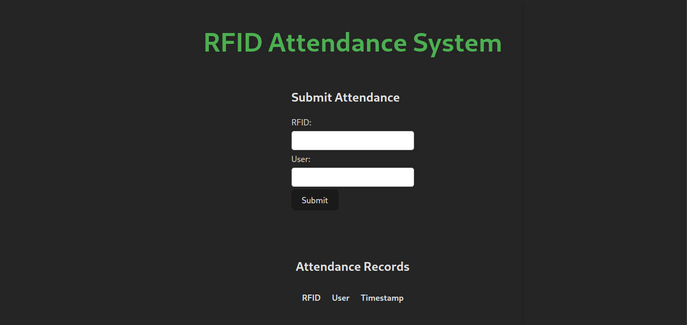

# RFID Attendance System

This project is a basic RFID-based attendance system that records attendance using RFID tags. The system consists of a Node.js backend built with Express and MongoDB, and a React frontend that allows users to manually submit attendance. Additionally, attendance is automatically recorded when an ESP8266 (or other microcontroller) sends an RFID check request to the backend.




## Features

- **Manual Attendance Submission**: Users can manually submit their RFID and name via a form in the frontend.
- **Automatic Attendance**: The ESP8266 (or other microcontroller) can make requests to the backend to automatically record attendance based on RFID scans.
- **Attendance List**: The frontend displays a list of all attendance records.

## Prerequisites

Before running this project, ensure you have the following installed:

- [Node.js](https://nodejs.org/) (v12 or above)
- [MongoDB](https://www.mongodb.com/)
- [npm](https://www.npmjs.com/) or [yarn](https://yarnpkg.com/)

## Project Structure

```bash
/rfid-attendance-System  # Contains the Express server and MongoDB schema
/rfid-attendance-frontend # React app for manual attendance submission and display
```

## Backend Setup

### 1. Clone the Repository

```bash
git clone https://github.com/your-repo/rfid-attendance-system.git
cd rfid-attendance-system/rfid-attendance-system
```

### 2. Install Dependencies

```bash
npm install
```

### 3. MongoDB Setup

Ensure MongoDB is running, or use a cloud MongoDB service like [MongoDB Atlas](https://www.mongodb.com/cloud/atlas). Update the MongoDB connection string in your `server.js` file (or use environment variables).

```javascript
mongoose.connect('your-mongodb-uri', {
  useNewUrlParser: true,
  useUnifiedTopology: true,
});
```

### 4. Start the Server

```bash
npm start
```

The server will run on `http://localhost:3000`.

### API Endpoints

- **GET /attendance**: Fetch all attendance records.
- **GET /attendance/:rfid**: Fetch attendance records for a specific RFID.
- **POST /attendance**: Manually submit attendance (with `rfid` and `user`).
- **POST /attendance/check**: Automatically check attendance using an RFID scan.

## Frontend Setup

### 1. Navigate to the Frontend

```bash
cd ../rfid-attendance-frontend
```

### 2. Install Dependencies

```bash
npm install
```

### 3. Start the Frontend

```bash
npm start
```

The frontend will be available on `http://localhost:3001`.

## Using the System

### Manual Attendance Submission

- The frontend includes a form where users can submit their RFID and name to manually record attendance.
- After submitting, the new attendance record will be displayed in the list below the form.

### Automatic Attendance via ESP8266

- When an ESP8266 scans an RFID tag, it makes a `POST` request to `/attendance/check` with the `rfid`. If the RFID exists in the system, the backend will automatically generate an attendance record.

**Sample Request (from ESP8266)**:

```http
POST /attendance/check
Content-Type: application/json
{
  "rfid": "1234567890"
}
```

If the RFID exists, the response will include the new attendance record.

## Models

### Attendance Schema

```javascript
const attendanceSchema = new mongoose.Schema({
  rfid: { type: String, required: true },
  user: { type: String, required: true },
  timestamp: { type: Date, default: Date.now },
});
```

## Future Enhancements

- Add user authentication.
- Add real-time notifications for attendance submissions.
- Implement role-based access (admin, student).
- Add analytics and reports for attendance records.

## License

This project is licensed under the MIT License - see the [LICENSE](LICENSE) file for details.

